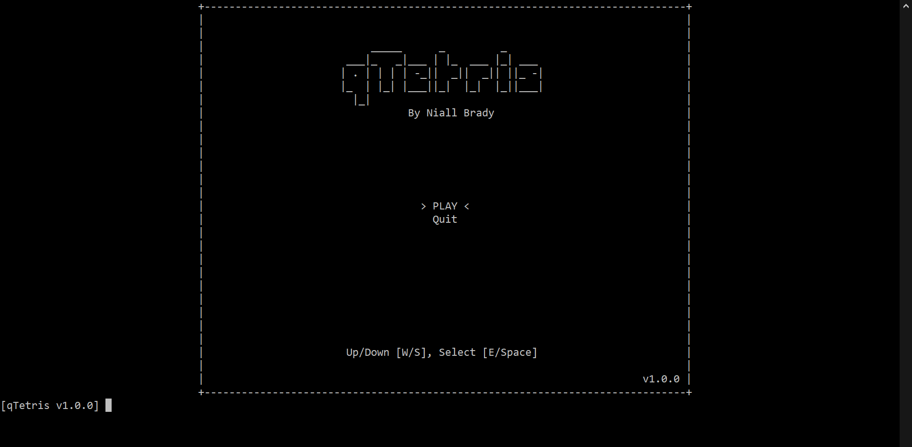
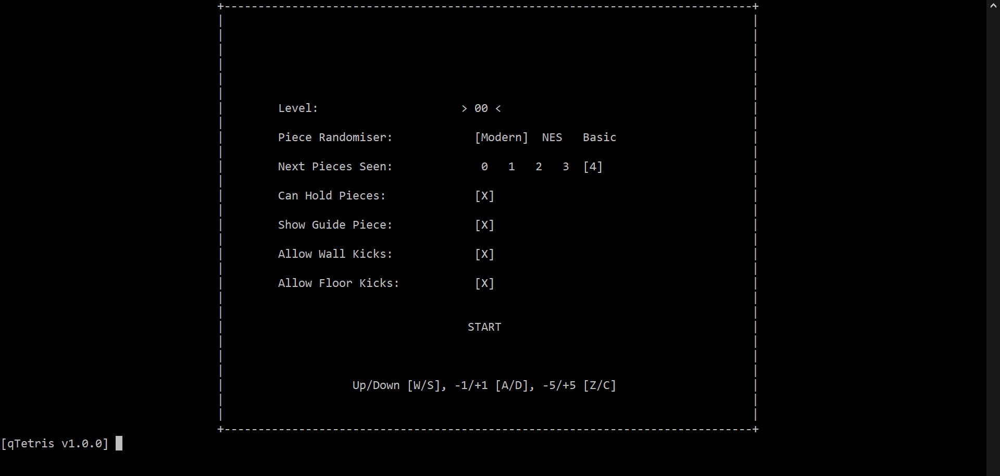
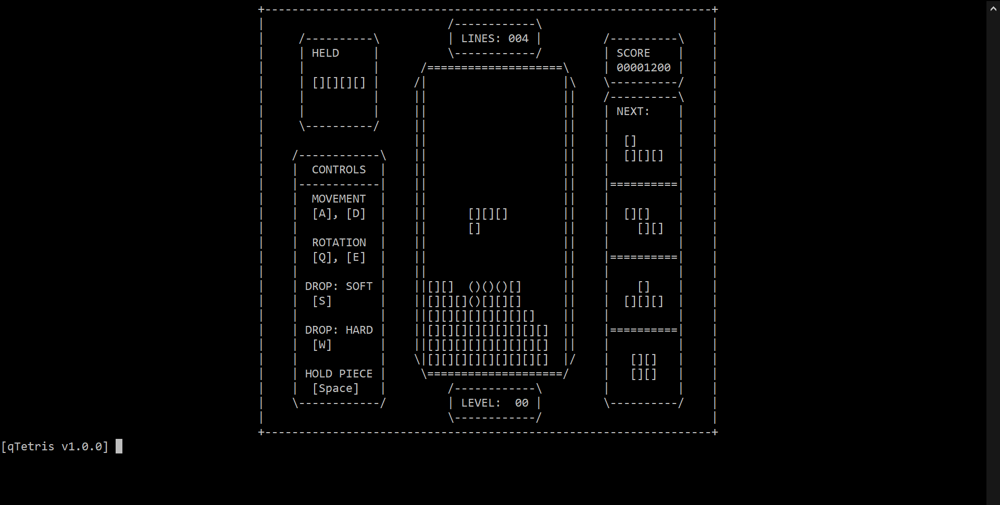

# qTetris

## Table of Contents
- [qTetris](#qtetris)
  - [Table of Contents](#table-of-contents)
  - [Requirements](#requirements)
  - [Introduction](#introduction)
  - [How to Play](#how-to-play)
  - [Commands](#commands)
    - [Global](#global)
    - [In-Game](#in-game)
  - [Extra Tips](#extra-tips)
  - [Screenshots](#screenshots)
    - [Menu](#menu)
    - [Pre-Game Config](#pre-game-config)
    - [Gameplay](#gameplay)

## Requirements
* `bash`
* `q/kdb+` (Tested in version 4.0)
* The Linux command `tput` (If wanting to have the game's interface centered in the window)

## Introduction

A text-based Tetris game written in Kx System's (https://kx.com/) programming language Q

## How to Play
To start the game execute the `run.sh` script. The game's controls are all displayed in-game except for special commands listed in the [Commands](#commands) section

## Commands

### Global
* `menu` - Go to main menu
* `quit`/`exit` - Quit game
* `fps X` - Set the game FPS to amount X (60 by default)

### In-Game
- `p` - Pause game

## Extra Tips
* The game's default FPS can be configured in `config.env`
* To register input the enter key must be pressed after the key is pressed

## Screenshots

### Menu

### Pre-Game Config

### Gameplay

